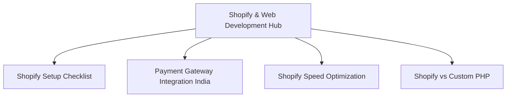

# Comprehensive SEO Audit & Strategic Growth Roadmap
**Client:** Hey Digital  
**URL:** [https://heydigital.work](https://heydigital.work)  
**Location:** Ponnamaravathi, Tamil Nadu, India  
**Prepared By:** Senior SEO Consultant (15+ Years Experience)

---

## Executive Summary

Hey Digital is a multi-disciplinary B2B digital agency offering high-intent professional services including **Website Development**, **Shopify Development**, **Digital Marketing**, **SEO**, **Branding**, **UI/UX Design**, and **Automation Solutions**. The agency's core objective is to dominate local search rankings in Ponnamaravathi, capture high-volume transactional keywords across Tamil Nadu and India, increase organic traffic, and generate B2B inbound leads.

This audit evaluates the codebase located at `c:/Users/SINGAPORE PC FACTORY/Downloads/agency-sitefile-main/agency-sitefile-main/heydigital-portfolio`, analyzes the current search presence, and outlines a prioritized 90-day execution framework.

---

## 1. Technical SEO Audit

A robust technical foundation ensures search engine bots can crawl, render, index, and interpret pages efficiently without losing search equity (PageRank).

### A. Indexing Issues & Crawlability
- **Status:** The site is structured using static HTML files deployed on Netlify or Vercel. Crawl paths are clean and indexable.
- **Explicit Redirects:** The codebase correctly routes `/index.html` to `/` via `301` redirects using the Netlify redirection configuration in [_redirects](file:///c:/Users/SINGAPORE%20PC%20FACTORY/Downloads/agency-sitefile-main/agency-sitefile-main/heydigital-portfolio/_redirects) and Vercel redirects in [vercel.json](file:///c:/Users/SINGAPORE%20PC%20FACTORY/Downloads/agency-sitefile-main/agency-sitefile-main/heydigital-portfolio/vercel.json).
- **Recommendation:** Do not block `/index.html` in `robots.txt`. Let search bots hit the link and trace the `301 permanent redirect` to pass page authority (link juice) to the root URL.

### B. Sitemap & Robots.txt
- **Robots.txt Analysis:** The current [robots.txt](file:///c:/Users/SINGAPORE%20PC%20FACTORY/Downloads/agency-sitefile-main/agency-sitefile-main/heydigital-portfolio/robots.txt) file is configured as follows:
  ```text
  User-agent: *
  Allow: /
  Sitemap: https://www.heydigital.work/sitemap.xml
  ```
  *Verdict:* Correct. It allows global crawl coverage and points to the sitemap location.
- **Sitemap.xml Analysis:** The [sitemap.xml](file:///c:/Users/SINGAPORE%20PC%20FACTORY/Downloads/agency-sitefile-main/agency-sitefile-main/heydigital-portfolio/sitemap.xml) registers 24 HTML files, including main services, local pages, and case studies.
  *Recommendation:* Ensure that when new location pages or blogs are added, they are immediately appended to the sitemap. If you migrate to a static site generator (e.g., Hugo, Eleventy, Next.js) in the future, automate the sitemap generation process.

### C. Canonical Tags
- **Findings:** Canonical tags are implemented on core pages (e.g., [index.html](file:///c:/Users/SINGAPORE%20PC%20FACTORY/Downloads/agency-sitefile-main/agency-sitefile-main/heydigital-portfolio/index.html) maps to `https://www.heydigital.work/` and [seo-services-ponnamaravathi.html](file:///c:/Users/SINGAPORE%20PC%20FACTORY/Downloads/agency-sitefile-main/agency-sitefile-main/heydigital-portfolio/seo-services-ponnamaravathi.html) maps to `https://www.heydigital.work/seo-services-ponnamaravathi.html`).
- **Recommendation:** Ensure all landing pages enforce the `www` version (`https://www.heydigital.work/`) to match the canonical declarations. Force HTTPS and WWW-resolving rules in your hosting dashboard.

### D. Structured Data & Schema Optimization
The current homepage contains a basic `ProfessionalService` schema. To build rich snippets and map Hey Digital into Google's Knowledge Graph, we need to upgrade to a comprehensive schema.

#### Upgrade Homepage Schema
Replace the current JSON-LD script block in the head of [index.html](file:///c:/Users/SINGAPORE%20PC%20FACTORY/Downloads/agency-sitefile-main/agency-sitefile-main/heydigital-portfolio/index.html) with:

```json
{
  "@context": "https://schema.org",
  "@type": "ProfessionalService",
  "name": "Hey Digital",
  "image": "https://www.heydigital.work/logo1.svg",
  "@id": "https://www.heydigital.work/#agency",
  "url": "https://www.heydigital.work",
  "telephone": "+918489310240",
  "priceRange": "$$",
  "address": {
    "@type": "PostalAddress",
    "streetAddress": "Ponnamaravathi",
    "addressLocality": "Pudukkottai",
    "addressRegion": "Tamil Nadu",
    "postalCode": "622407",
    "addressCountry": "IN"
  },
  "geo": {
    "@type": "GeoCoordinates",
    "latitude": 10.2319,
    "longitude": 78.6183
  },
  "openingHoursSpecification": {
    "@type": "OpeningHoursSpecification",
    "dayOfWeek": [
      "Monday", "Tuesday", "Wednesday", "Thursday", "Friday", "Saturday"
    ],
    "opens": "09:00",
    "closes": "19:00"
  },
  "areaServed": [
    {
      "@type": "AdministrativeArea",
      "name": "Ponnamaravathi"
    },
    {
      "@type": "AdministrativeArea",
      "name": "Pudukkottai"
    },
    {
      "@type": "AdministrativeArea",
      "name": "Tamil Nadu"
    },
    {
      "@type": "AdministrativeArea",
      "name": "India"
    }
  ],
  "hasOfferCatalog": {
    "@type": "OfferCatalog",
    "name": "Hey Digital Professional Services",
    "itemListElement": [
      {
        "@type": "Offer",
        "itemOffered": {
          "@type": "Service",
          "name": "Website Development Services",
          "description": "Custom high-performance web development utilizing static builds, React, and server-rendered frameworks."
        }
      },
      {
        "@type": "Offer",
        "itemOffered": {
          "@type": "Service",
          "name": "Shopify Store Development & Customization",
          "description": "End-to-end Shopify setup, theme development, custom Liquid solutions, and e-commerce optimization."
        }
      },
      {
        "@type": "Offer",
        "itemOffered": {
          "@type": "Service",
          "name": "Search Engine Optimization (SEO)",
          "description": "Technical audits, local maps SEO, link building, and content strategy to rank B2B platforms."
        }
      },
      {
        "@type": "Offer",
        "itemOffered": {
          "@type": "Service",
          "name": "Digital Marketing & B2B PPC Campaign Management",
          "description": "High-ROI paid search and social campaigns targeting qualified client acquisition."
        }
      },
      {
        "@type": "Offer",
        "itemOffered": {
          "@type": "Service",
          "name": "Business & Workflow Automation Solutions",
          "description": "Connecting databases, custom API integrations, CRM setups, and automated operations."
        }
      }
    ]
  },
  "sameAs": [
    "https://www.instagram.com/heydotin",
    "https://www.linkedin.com/company/hey-digitals/"
  ]
}
```

### E. Core Web Vitals & Page Speed Improvements
The current static pages load stylesheets and scripts synchronously. This blocks initial paints and compromises Core Web Vitals, specifically Largest Contentful Paint (LCP) and First Input Delay (FID) / Interaction to Next Paint (INP).

1. **Leverage Non-Blocking Fonts:** In the CSS assets, add `font-display: swap;` inside all `@font-face` declarations. This forces the browser to display fallback system typography instantly while downloading custom web fonts, eliminating the Flash of Invisible Text (FOIT).
2. **Asynchronous JavaScript Loading:** Ensure non-core layout libraries (Gtag analytics, fancybox, swiper scripts) are loaded with the `defer` or `async` attribute in the footer of all pages.
3. **SVG Attribute Optimization:** The logo is loaded as `logo1.svg`. To minimize Cumulative Layout Shift (CLS), explicitly define `width` and `height` attributes on the logo's wrapper element.
4. **CSS and JS Minification:** Compile and minify `style.css` (currently written via SCSS).

### F. Mobile Optimization
- The current viewport configuration (`<meta name="viewport" content="width=device-width, initial-scale=1.0">`) is mobile-friendly.
- **Recommendation:** Verify that touch targets (such as hamburger menus, external social buttons, and form selectors) have a minimum dimension of **48px x 48px** with appropriate margins to prevent tap errors on handheld devices.

---

## 2. On-Page SEO

On-page SEO aligns page metadata, content structure, and internal layout with target search queries.

### A. Homepage SEO Upgrades
The current home meta targets are highly diluted (mixing SaaS PPC, native app code, and local Pudukkottai targets). We need to align the metadata to target local search intents.

- **Current Title:** `B2B SaaS PPC & Digital Agency in Pudukkottai & Ponnamaravathy – HeyDigitals`
- **Optimized Title:** `Digital Marketing & Web Development Company in Ponnamaravathi | Hey Digital`
  - *Rationale:* Focuses directly on the primary local commercial queries: "Digital Marketing Agency in Ponnamaravathi" and "Website Development Company in Ponnamaravathi".
- **Current Meta Description:** `Scale pipeline and revenue with HeyDigitals, a premier B2B SaaS PPC, web development, and digital agency in Pudukkottai & Ponnamaravathy, specializing in paid ads, custom websites, and automation.`
- **Optimized Meta Description:** `Scale your business with Hey Digital, the leading digital marketing & web development agency in Ponnamaravathi, Tamil Nadu. Specializing in SEO, Shopify, and B2B PPC. Contact us today.`

### B. Heading (H1-H6) Structure
A clean heading hierarchy outlines the relative importance of content blocks to Google's parser.
- **Current Setup:** The homepage [index.html](file:///c:/Users/SINGAPORE%20PC%20FACTORY/Downloads/agency-sitefile-main/agency-sitefile-main/heydigital-portfolio/index.html) uses typography-based wrapper utility styles (e.g., `<h1 class="mil-muted mil-mb-60">Designing <span class="mil-thin">a Better</span><br> World <span class="mil-thin">Today</span></h1>`). This misses the primary heading target.
- **Correction Action:** Restructure headings to reflect keyword target hierarchies:
  - **H1 (Exactly one per page):**
    ```html
    <h1 class="mil-muted mil-mb-60">Digital Marketing & <span class="mil-thin">Web Development Company</span><br> in Ponnamaravathi</h1>
    ```
  - **H2 Sections:**
    - `<h2>Custom Web Development & Shopify E-Commerce Solutions</h2>`
    - `<h2>Results-Driven SEO & Digital Marketing in Tamil Nadu</h2>`
    - `<h2>B2B Workflow & Marketing Automation Solutions</h2>`
  - **H3 Sections (Sub-features):**
    - `<h3>Enterprise-Grade App Development</h3>`
    - `<h3>High-ROI Performance Marketing (PPC)</h3>`

### C. Image Optimization
- Ensure all images have a semantic file structure. Replace names like `photo/2.jpg` or `faces/3.jpg` with keyword-rich names (e.g., `web-development-team-ponnamaravathi.webp`).
- Compress and convert JPG/PNG portfolio assets to **WebP** or **AVIF** format.
- Add descriptive `alt` tags across all images. Instead of `alt="team"`, use `alt="Hey Digital Website Development and Design Studio Team"`.

### D. Internal Linking & Keyword Placement
- **Internal Linking:** Ensure location-based landing pages (e.g., `/digital-marketing-agency-pudukkottai.html`) link back to the main service hub pages (`/services.html` and `/service.html`) using descriptive anchor texts instead of generic "learn more" links.
- **First 100 Words:** Include target keywords early in the introductory paragraphs of all pages.

---

## 3. Local SEO Strategy

For B2B agencies in smaller geographic regions, Local SEO is the highest-converting traffic source.

### A. Google Business Profile (GBP) Optimization
1. **Core Name Optimization:** Register the business as: **Hey Digital - Website Development & Digital Marketing Agency**. (Including primary categories in the business name helps with rankings, but keep it natural).
2. **Primary Categories:**
   - *Primary:* Website Designer
   - *Secondary:* Marketing Agency, Internet Marketing Service, Software Company, Graphic Designer.
3. **Address & Geolocation:** Verify a physical location in Ponnamaravathi, Tamil Nadu - 622407. Match coordinates (`10.2319`, `78.6183`) in the site schema.
4. **Service Areas:** Add *Pudukkottai, Karaikudi, Madurai, Trichy, Coimbatore, and Chennai*.
5. **Services Catalog:** Populate the GBP dashboard with descriptions of individual service catalog items (e.g., "Shopify Setup," "Local SEO," "Custom Software Development"), directly linking to target service URLs.

### B. NAP (Name, Address, Phone) Consistency
Ensure the Name, Address, and Phone details are identically listed across the site footer and all directory profiles:
- **Format:** `Hey Digital, Ponnamaravathi, Pudukkottai, Tamil Nadu - 622407. Phone: +91 84893 10240`

### C. Local Citations & Directories
Submit the business NAP details to leading Indian business listing directories:
- Justdial, Sulekha, IndiaMART, YellowPages India, AskLaila, and TradeIndia.

### D. Review Acquisition Loop
- Create a short link to point customers directly to the GBP review page (e.g., `https://g.page/r/[your-id]/review`).
- Create an automated WhatsApp/Email follow-up campaign triggered upon launching a client's website or completing a digital marketing campaign.
- **Target:** Accumulate at least **15 verified 5-star reviews** with keywords like "web development in Ponnamaravathi", "Shopify designer", and "best digital marketing agency" within 30 days.

### E. Local Landing Pages Strategy
To rank for queries across neighboring regions (Karaikudi, Pudukkottai, Trichy, Chennai, Madurai) without triggering duplicate content penalties:
- Add a unique Google Map iframe embed pointing to the local region.
- Include localized client quotes or region-specific project case studies.
- Avoid simply copying and pasting content and replacing location names. Include regional challenges, local business contexts, and local team insights.

---

## 4. Content Strategy & Topic Clusters

Topical authority is established when a website demonstrates depth in a specific area by organizing content into logical clusters.

### A. Hub-and-Spoke (Topic Cluster) Framework



### B. 30 Highly Optimized Blog Post Ideas

#### Cluster A: Shopify & E-commerce (Regional & National Targeting)
1. **Title:** How to Launch a Shopify Store in India: The Complete Step-by-Step Guide
   - *Target Keyword:* How to start a Shopify store in India
   - *User Intent:* Informational / Transactional
2. **Title:** Best Shopify Payment Gateways for Indian E-commerce Brands (2026 Comparison)
   - *Target Keyword:* Shopify payment gateway India
   - *User Intent:* Informational / Commercial
3. **Title:** Shopify Speed Optimization: How to Make Your Store Load in Under 2 Seconds
   - *Target Keyword:* Shopify speed optimization services
   - *User Intent:* Commercial
4. **Title:** Shopify vs WooCommerce: Which Platform is Right for Your Indian Retail Business?
   - *Target Keyword:* Shopify vs WooCommerce India
   - *User Intent:* Informational
5. **Title:** 7 Critical Shopify SEO Settings to Build Organic Traffic Without Paid Ads
   - *Target Keyword:* Shopify SEO checklist
   - *User Intent:* Informational
6. **Title:** Custom Shopify Theme Development: Why Pre-made Templates Slow Down Your Sales
   - *Target Keyword:* Custom Shopify theme developer
   - *User Intent:* Commercial
7. **Title:** How to Integrate UPI and WhatsApp Orders on Shopify for Higher Conversions
   - *Target Keyword:* UPI integration Shopify India
   - *User Intent:* Informational
8. **Title:** Retail Digital Transformation: Moving Your Offline Shop to Shopify E-Commerce
   - *Target Keyword:* Offline to online business transition
   - *User Intent:* Commercial
9. **Title:** The Cost of Shopify Development in India: Budgeting for Theme, Apps, and Setup
   - *Target Keyword:* Shopify development cost India
   - *User Intent:* Commercial
10. **Title:** 5 Common Shopify Setup Mistakes that Lose Customers (and How to Avoid Them)
    - *Target Keyword:* Shopify setup mistakes
    - *User Intent:* Informational

#### Cluster B: Web Design & Development (Local B2B Focus)
11. **Title:** Why Your Local Business Needs a Website in Ponnamaravathi to Face Competition
    - *Target Keyword:* Website developer in Ponnamaravathi
    - *User Intent:* Commercial
12. **Title:** Mobile-First Web Design: Keeping Mobile Visitors Hooked in 2026
    - *Target Keyword:* Responsive web design services
    - *User Intent:* Informational
13. **Title:** The Ultimate Website Development Checklist for B2B Services & Lead Gen
    - *Target Keyword:* Web development checklist
    - *User Intent:* Informational
14. **Title:** How to Hire the Best Web Development Company in Pudukkottai
    - *Target Keyword:* Web development company in Pudukkottai
    - *User Intent:* Commercial
15. **Title:** React vs Static HTML: Choosing the Right Framework for Your Business Site
    - *Target Keyword:* Static site vs React
    - *User Intent:* Informational
16. **Title:** 7 UI/UX Design Principles that Boost B2B Landing Page Sign-ups by 200%
    - *Target Keyword:* UI UX design agency Tamil Nadu
    - *User Intent:* Commercial
17. **Title:** Why Regular Website Maintenance is Crucial for Security and SEO Performance
    - *Target Keyword:* Website maintenance packages
    - *User Intent:* Commercial
18. **Title:** Custom Web Development vs WordPress Page Builders: Speed, Security, and Scalability
    - *Target Keyword:* Custom web development services
    - *User Intent:* Informational
19. **Title:** Designing High-Performance Portfolio Sites for B2B Agencies & Creative Studios
    - *Target Keyword:* Portfolio website design
    - *User Intent:* Commercial
20. **Title:** How Bad Web Design Can Damage Your Local SEO Rankings and Search Traffic
    - *Target Keyword:* Web design and local SEO
    - *User Intent:* Informational

#### Cluster C: B2B Marketing, Local SEO, and Operations Automation
21. **Title:** What is Marketing Automation and How It Can Save Your Business 15 Hours Weekly
    - *Target Keyword:* Business automation agency India
    - *User Intent:* Commercial
22. **Title:** 10 Proven Digital Marketing Channels for Small Businesses in Tamil Nadu
    - *Target Keyword:* Digital marketing in Tamil Nadu
    - *User Intent:* Informational
23. **Title:** How to Choose an SEO Agency in Ponnamaravathi: Red Flags to Avoid
    - *Target Keyword:* SEO agency in Ponnamaravathi
    - *User Intent:* Commercial
24. **Title:** Google Ads for SaaS: Structuring Campaigns to Acquire Quality Leads Under Budget
    - *Target Keyword:* B2B PPC agency India
    - *User Intent:* Commercial
25. **Title:** Local SEO Blueprint: How to Rank in the Google Maps 3-Pack
    - *Target Keyword:* Google Map SEO tips
    - *User Intent:* Informational
26. **Title:** Setup Customer Nurture Automation: Turning Cold Leads into Active Inquiries
    - *Target Keyword:* Lead nurture automation
    - *User Intent:* Commercial
27. **Title:** Branding Strategies for Startups: Setting Your Digital Footprint
    - *Target Keyword:* Branding agency in Ponnamaravathi
    - *User Intent:* Commercial
28. **Title:** Transparent SEO Pricing: How Much Does SEO Services Cost in Tamil Nadu?
    - *Target Keyword:* SEO packages Tamil Nadu
    - *User Intent:* Commercial
29. **Title:** The Power of Lead Magnets: Designing Assets that Build B2B Mailing Lists
    - *Target Keyword:* B2B lead generation agency
    - *User Intent:* Commercial
30. **Title:** Using Zapier and Custom APIs to Streamline Customer Communication
    - *Target Keyword:* Workflow automation solutions
    - *User Intent:* Informational

---

## 5. Backlink & Outreach Strategy

Backlinks act as votes of confidence. To build domain authority, target contextual links from local and business sources.

### A. Local Directories
Register NAP profiles in regional registries:
- `tndirectory.com`
- `tamilnaduyellowpages.com`
- local chambers of commerce.

### B. High-Quality B2B Profiles
Clutch.co, GoodFirms, and Sortlist are high-authority platforms. Google often ranks these directories for terms like "best web developers in Pudukkottai". A profile here helps capture directory referral traffic.

### C. Guest Posting Outreach
Identify marketing, development, and e-commerce blogs accepting guest contributions. Use Google Search Operators to find opportunities:
- `"write for us" + "Shopify"`
- `"guest post" + "digital marketing"`
- `"contributing writer" + "web design"`

#### Outreach Pitch Email Template
```text
Subject: Contributor pitch: [Proposed Headline] - Hey Digital

Hi [Editor's Name],

I hope this email finds you well.

My name is [Your Name], and I'm the lead designer at Hey Digital. We build high-performance Shopify stores and B2B platforms.

I've been reading your blog and particularly liked your recent article on [mention a recent post]. It inspired me to pitch a guest post that I think would provide high value to your audience:

Topic: "Shopify Speed Optimization: How we optimized a Liquid theme to load in 1.4s"
Key takeaways:
- Identifying script bottlenecks (analyzing third-party apps).
- Best practices for optimizing custom CSS and SVG resources.
- Case study metrics: improving conversion rates by 22% after speed tuning.

Alternatively, I could write on: [Second Topic Choice].

Here are two examples of my writing/portfolio work:
- [Link to Portfolio/Case Study]
- [Link to another piece]

Please let me know if this aligns with your editorial calendar.

Best regards,
[Your Name]  
Hey Digital (https://heydigital.work)
```

### D. Freelancer & Studio Partnerships
Reach out to local freelance graphic designers, branding specialists, or copywriters in Ponnamaravathi, Madurai, and Trichy who do not offer development or automation services. Propose a referral program to handle their coding needs.

---

## 6. Competitor Analysis

### A. Top Regional Competitors
1. **Local Software Shops (Pudukkottai, Trichy, Madurai):** Typically focus on offline printing, standard hosting, and basic PHP/WordPress sites.
   - *Strengths:* Strong local networks, face-to-face trust, lower pricing.
   - *Weaknesses:* Poor technical SEO, slow page loads, no schema implementation, lack of content marketing.
2. **National Agencies (Chennai, Bangalore, Mumbai):** Larger development houses targeting global keywords.
   - *Strengths:* High domain authority, large client portfolios, dedicated marketing teams.
   - *Weaknesses:* Premium pricing, lack of personalized support, do not target local keywords.

### B. Keyword Gap & Niche Analysis
Competitors prioritize high-volume keywords, creating opportunities for mid-tail and local terms:
- **Niche Gap 1: "Shopify Development Services in Tamil Nadu".** National agencies focus on India-wide terms, leaving statewide queries accessible with focused landing pages.
- **Niche Gap 2: "Business Automation Agency Ponnamaravathi".** Local competitors rarely optimize for workflow automation, offering a clear opportunity to capture local B2B leads.
- **Niche Gap 3: "Flutter App Development Company in Tamil Nadu".** Large agencies target general mobile app queries. Framework-focused regional terms (Flutter, iOS, Android) are easier to target and rank.

---

## 7. Action Plan & Prioritized Checklist

Below is a prioritized checklist mapping the audit recommendations, categorized by implementation timelines.

### Phase 1: Quick Wins (Days 1–7)
Focus on immediate code improvements to optimize indexability and target local keywords.

| Action Item | Target Location/File | SEO Impact | Difficulty |
| :--- | :--- | :--- | :--- |
| **Revise Homepage Title Tag** | [index.html](file:///c:/Users/SINGAPORE%20PC%20FACTORY/Downloads/agency-sitefile-main/agency-sitefile-main/heydigital-portfolio/index.html) | **High** | Easy |
| **Optimize Homepage Meta Description** | [index.html](file:///c:/Users/SINGAPORE%20PC%20FACTORY/Downloads/agency-sitefile-main/agency-sitefile-main/heydigital-portfolio/index.html) | **High** | Easy |
| **Implement LocalBusiness Schema** | [index.html](file:///c:/Users/SINGAPORE%20PC%20FACTORY/Downloads/agency-sitefile-main/agency-sitefile-main/heydigital-portfolio/index.html) | **High** | Medium |
| **Correct Heading Hierarchy (H1/H2)** | [index.html](file:///c:/Users/SINGAPORE%20PC%20FACTORY/Downloads/agency-sitefile-main/agency-sitefile-main/heydigital-portfolio/index.html) | **Medium** | Easy |
| **Verify Robots.txt & Sitemap Links** | [robots.txt](file:///c:/Users/SINGAPORE%20PC%20FACTORY/Downloads/agency-sitefile-main/agency-sitefile-main/heydigital-portfolio/robots.txt) & [sitemap.xml](file:///c:/Users/SINGAPORE%20PC%20FACTORY/Downloads/agency-sitefile-main/agency-sitefile-main/heydigital-portfolio/sitemap.xml) | **High** | Easy |
| **Audit Canonical Tags on Subpages** | All `.html` files | **High** | Easy |

### Phase 2: Medium-Term Tasks (Days 8–30)
Focus on local authority and performance optimization.

| Action Item | Target Location/File | SEO Impact | Difficulty |
| :--- | :--- | :--- | :--- |
| **Google Business Profile Claim & Setup** | GBP Dashboard | **High** | Easy |
| **Acquire 15 Verified GBP Reviews** | Client outreach campaign | **High** | Medium |
| **Submit NAP to 10 Indian Directories** | Sulekha, Justdial, Sulekha | **Medium** | Easy |
| **Optimize Image Formats to WebP** | Media asset folders | **Medium** | Easy |
| **Add font-display: swap to Fonts** | CSS stylesheets | **Medium** | Easy |
| **Build Core Web Vitals Fixes (Defer JS)**| Footers of all HTML pages | **Medium** | Medium |

### Phase 3: Long-Term Strategy (Days 31–90)
Focus on content building, outreach, and capturing regional traffic.

| Action Item | Target Location/File | SEO Impact | Difficulty |
| :--- | :--- | :--- | :--- |
| **Create Location-Specific Landing Pages**| New regional HTML templates | **High** | Medium |
| **Write and Link first 5 Shopify Blogs**| `/blog/` folder structure | **High** | Hard |
| **Clutch and GoodFirms B2B Setup** | Directory profiles | **Medium** | Easy |
| **Launch Guest Posting Outreach** | Industry blog submissions | **High** | Hard |
| **Partnership Outreach to Designers** | Freelancer pitch campaign | **Medium** | Medium |
| **Produce Rest of 30 Blog Ideas** | Continuous monthly schedule | **High** | Hard |
